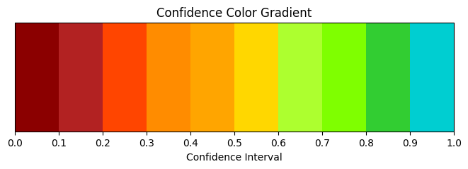

# color

## Overview

This folder contains programs about color.

## Components

| Component | Description |
| --------- | ----------- |
| [color_converter.py](color_converter.py) | Program to convert colors from one format to another |
| [id2color.py](id2color.py) | Program to assign random colors for each ID |
| [ratio2colors.py](ratio2colors.py) | Program to convert values in [0,1] range (like confidence) to colors |

## Color Sample

The image below shows color samples for the `ratio2colors` function, which converts confidence values (0.0 to 1.0) into corresponding colors:

